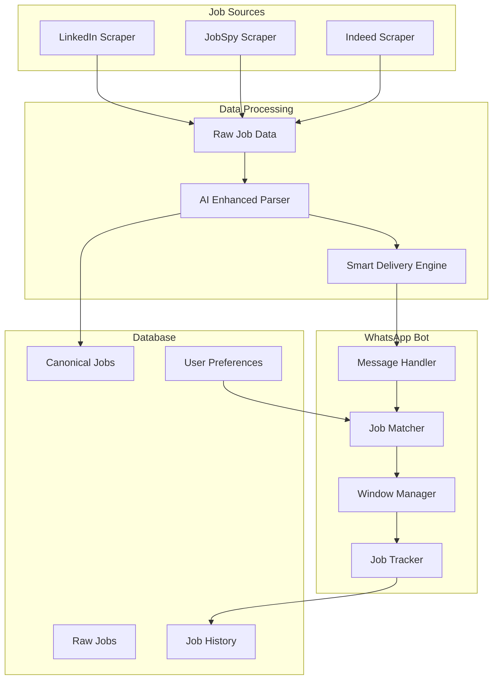

# 📁 Aremu Project Structure

## 🎯 Overview

This document outlines the complete project structure for the Aremu Intelligent WhatsApp Job Distribution System.

## 📂 Directory Structure

```
aremu-job-system/
├── 📄 README.md                           # Main project documentation
├── 📄 SYSTEM_ARCHITECTURE.md              # System architecture details
├── 📄 API_DOCUMENTATION.md                # API and interface documentation
├── 📄 DEPLOYMENT_GUIDE.md                 # Production deployment guide
├── 📄 PROJECT_STRUCTURE.md                # This file
├── 📄 CONTRIBUTING.md                     # Contribution guidelines
├── 📄 LICENSE                             # Project license
├── 📄 .gitignore                          # Git ignore rules
├── 📄 docker-compose.yml                  # Docker composition for development
├── 📄 Dockerfile                          # Docker container definition
│
├── 📁 whatsapp_bot/                       # 🤖 WhatsApp Bot Application
│   ├── 📄 app.py                          # Main Flask application
│   ├── 📄 database_manager.py             # Database operations
│   ├── 📄 flexible_preference_manager.py  # User preference handling
│   ├── 📄 intelligent_job_matcher.py      # Advanced job matching
│   ├── 📄 job_tracking_system.py          # Duplicate prevention
│   ├── 📄 window_management_system.py     # 24-hour window optimization
│   ├── 📄 realtime_job_monitor.py         # Background job monitoring
│   ├── 📄 requirements.txt                # Python dependencies
│   ├── 📄 .env                            # Environment variables
│   ├── 📄 .env.example                    # Environment template
│   ├── 📄 config.py                       # Application configuration
│   ├── 📄 logging_config.py               # Logging setup
│   ├── 📄 metrics.py                      # Performance metrics
│   │
│   ├── 📁 tests/                          # Unit tests
│   │   ├── 📄 test_app.py                 # Main app tests
│   │   ├── 📄 test_job_matcher.py         # Matching algorithm tests
│   │   ├── 📄 test_preference_manager.py  # Preference handling tests
│   │   ├── 📄 test_window_manager.py      # Window management tests
│   │   └── 📄 conftest.py                 # Test configuration
│   │
│   ├── 📁 utils/                          # Utility functions
│   │   ├── 📄 __init__.py
│   │   ├── 📄 text_processing.py          # Text processing utilities
│   │   ├── 📄 validation.py               # Input validation
│   │   └── 📄 helpers.py                  # General helper functions
│   │
│   └── 📁 templates/                      # Message templates
│       ├── 📄 job_alert.txt               # Job alert template
│       ├── 📄 confirmation.txt            # Preference confirmation
│       ├── 📄 welcome.txt                 # Welcome message
│       └── 📄 battery_warning.txt         # Battery warning message
│
├── 📁 data_parser/                        # 🔄 Data Processing Engine
│   ├── 📄 smart_delivery_engine.py        # Real-time job delivery
│   ├── 📄 requirements.txt                # Python dependencies
│   ├── 📄 .env                            # Environment variables
│   │
│   ├── 📁 parsers/                        # Job parsing modules
│   │   ├── 📄 __init__.py
│   │   ├── 📄 ai_enhanced_parser.py       # AI-enhanced job processing
│   │   ├── 📄 base_parser.py              # Base parser class
│   │   └── 📄 job_normalizer.py           # Job data normalization
│   │
│   ├── 📁 sources/                        # Job source integrations
│   │   ├── 📄 __init__.py
│   │   ├── 📄 linkedin_source.py          # LinkedIn integration
│   │   ├── 📄 indeed_source.py            # Indeed integration
│   │   └── 📄 jobspy_source.py            # JobSpy integration
│   │
│   └── 📁 tests/                          # Parser tests
│       ├── 📄 test_ai_parser.py           # AI parser tests
│       ├── 📄 test_smart_delivery.py      # Delivery engine tests
│       └── 📄 test_sources.py             # Source integration tests
│
├── 📁 scraper/                            # 🕷️ Job Scraping Components
│   ├── 📄 requirements.txt                # Scraper dependencies
│   │
│   ├── 📁 linkedin/                       # LinkedIn scraper
│   │   ├── 📄 enhanced_linkedin_scraper.py # Advanced LinkedIn scraper
│   │   ├── 📄 linkedin_config.py          # LinkedIn configuration
│   │   └── 📄 linkedin_utils.py           # LinkedIn utilities
│   │
│   ├── 📁 jobspy/                         # JobSpy integration
│   │   ├── 📄 jobspy_scraper.py           # JobSpy wrapper
│   │   └── 📄 jobspy_config.py            # JobSpy configuration
│   │
│   └── 📁 common/                         # Shared scraper utilities
│       ├── 📄 __init__.py
│       ├── 📄 rate_limiter.py             # Rate limiting
│       ├── 📄 proxy_manager.py            # Proxy management
│       └── 📄 data_validator.py           # Data validation
│
├── 📁 database/                           # 🗄️ Database Components
│   ├── 📄 schema.sql                      # Database schema
│   ├── 📄 migrations/                     # Database migrations
│   │   ├── 📄 001_initial_schema.sql      # Initial schema
│   │   ├── 📄 002_add_ai_fields.sql       # AI enhancement fields
│   │   ├── 📄 003_add_window_mgmt.sql     # Window management
│   │   └── 📄 004_add_job_tracking.sql    # Job tracking system
│   │
│   ├── 📄 indexes.sql                     # Performance indexes
│   ├── 📄 views.sql                       # Database views
│   └── 📄 functions.sql                   # Stored procedures
│
├── 📁 scripts/                            # 🛠️ Utility Scripts
│   ├── 📄 setup.sh                        # Initial setup script
│   ├── 📄 deploy.sh                       # Deployment script
│   ├── 📄 backup_db.sh                    # Database backup
│   ├── 📄 health_check.sh                 # Health monitoring
│   ├── 📄 weekly_maintenance.sh           # Maintenance tasks
│   ├── 📄 migrate_db.py                   # Database migration runner
│   └── 📄 seed_data.py                    # Test data seeding
│
├── 📁 config/                             # ⚙️ Configuration Files
│   ├── 📄 nginx.conf                      # Nginx configuration
│   ├── 📄 systemd/                        # Systemd service files
│   │   ├── 📄 aremu-bot.service           # WhatsApp bot service
│   │   ├── 📄 aremu-parser.service        # Data parser service
│   │   └── 📄 aremu-parser.timer          # Parser timer
│   │
│   ├── 📄 docker/                         # Docker configurations
│   │   ├── 📄 Dockerfile.bot              # Bot container
│   │   ├── 📄 Dockerfile.parser           # Parser container
│   │   └── 📄 docker-compose.prod.yml     # Production compose
│   │
│   └── 📄 kubernetes/                     # Kubernetes manifests
│       ├── 📄 deployment.yaml             # Application deployment
│       ├── 📄 service.yaml                # Service definition
│       ├── 📄 configmap.yaml              # Configuration map
│       └── 📄 ingress.yaml                # Ingress configuration
│
├── 📁 docs/                               # 📚 Documentation
│   ├── 📄 user_guide.md                   # User guide
│   ├── 📄 admin_guide.md                  # Administrator guide
│   ├── 📄 troubleshooting.md              # Troubleshooting guide
│   ├── 📄 performance_tuning.md           # Performance optimization
│   ├── 📄 security_guide.md               # Security best practices
│   │
│   ├── 📁 diagrams/                       # System diagrams
│   │   ├── 📄 architecture.png            # Architecture diagram
│   │   ├── 📄 data_flow.png               # Data flow diagram
│   │   ├── 📄 user_journey.png            # User journey map
│   │   └── 📄 deployment.png              # Deployment diagram
│   │
│   └── 📁 api/                            # API documentation
│       ├── 📄 openapi.yaml                # OpenAPI specification
│       ├── 📄 webhooks.md                 # Webhook documentation
│       └── 📄 examples.md                 # API examples
│
├── 📁 tests/                              # 🧪 Integration Tests
│   ├── 📄 test_integration.py             # End-to-end tests
│   ├── 📄 test_performance.py             # Performance tests
│   ├── 📄 test_security.py                # Security tests
│   └── 📄 fixtures/                       # Test fixtures
│       ├── 📄 sample_jobs.json            # Sample job data
│       ├── 📄 sample_users.json           # Sample user data
│       └── 📄 test_messages.json          # Test WhatsApp messages
│
├── 📁 monitoring/                         # 📊 Monitoring & Observability
│   ├── 📄 prometheus.yml                  # Prometheus configuration
│   ├── 📄 grafana/                        # Grafana dashboards
│   │   ├── 📄 system_metrics.json         # System metrics dashboard
│   │   ├── 📄 application_metrics.json    # Application metrics
│   │   └── 📄 user_engagement.json        # User engagement metrics
│   │
│   ├── 📄 alerts/                         # Alert configurations
│   │   ├── 📄 system_alerts.yml           # System alerts
│   │   ├── 📄 application_alerts.yml      # Application alerts
│   │   └── 📄 business_alerts.yml         # Business metric alerts
│   │
│   └── 📄 logs/                           # Log configurations
│       ├── 📄 logrotate.conf              # Log rotation
│       └── 📄 rsyslog.conf                # System logging
│
├── 📁 tools/                              # 🔧 Development Tools
│   ├── 📄 data_generator.py               # Test data generator
│   ├── 📄 performance_tester.py           # Performance testing
│   ├── 📄 db_analyzer.py                  # Database analysis
│   ├── 📄 job_simulator.py                # Job scraping simulator
│   └── 📄 user_simulator.py               # User interaction simulator
│
└── 📁 examples/                           # 📝 Usage Examples
    ├── 📄 basic_usage.py                  # Basic usage examples
    ├── 📄 advanced_matching.py            # Advanced matching examples
    ├── 📄 custom_integration.py           # Custom integration examples
    └── 📄 webhook_examples.py             # Webhook handling examples
```

## 🔧 Key Components Explained

### **1. WhatsApp Bot (`/whatsapp_bot/`)**
The core application that handles WhatsApp interactions, user management, and job delivery.

**Main Files:**
- `app.py` - Flask application with webhook handling
- `intelligent_job_matcher.py` - Advanced matching algorithms
- `window_management_system.py` - Cost optimization system
- `job_tracking_system.py` - Duplicate prevention

### **2. Data Parser (`/data_parser/`)**
Processes raw job data, enhances with AI, and triggers real-time delivery.

**Main Files:**
- `parsers/ai_enhanced_parser.py` - AI-powered job enhancement
- `smart_delivery_engine.py` - Real-time job distribution
- `sources/` - Integration with various job sources

### **3. Scraper (`/scraper/`)**
Collects job data from multiple sources with rate limiting and anti-detection.

**Main Files:**
- `linkedin/enhanced_linkedin_scraper.py` - LinkedIn job scraping
- `jobspy/jobspy_scraper.py` - Multi-platform job aggregation
- `common/` - Shared utilities for all scrapers

### **4. Database (`/database/`)**
Schema definitions, migrations, and database optimization.

**Main Files:**
- `schema.sql` - Complete database schema
- `migrations/` - Version-controlled schema changes
- `indexes.sql` - Performance optimization indexes

### **5. Configuration (`/config/`)**
Production deployment configurations for various environments.

**Main Files:**
- `nginx.conf` - Web server configuration
- `systemd/` - Linux service definitions
- `docker/` - Container configurations
- `kubernetes/` - Orchestration manifests

## 📊 Data Flow Between Components



## 🚀 Getting Started

### **1. Development Setup**
```bash
# Clone repository
git clone <repository-url>
cd aremu-job-system

# Setup WhatsApp bot
cd whatsapp_bot
python -m venv venv
source venv/bin/activate
pip install -r requirements.txt
cp .env.example .env
# Edit .env with your credentials

# Setup data parser
cd ../data_parser
pip install -r requirements.txt

# Initialize database
cd ../whatsapp_bot
python database_manager.py
```

### **2. Running the System**
```bash
# Start WhatsApp bot
cd whatsapp_bot
python app.py

# Run data parser (separate terminal)
cd data_parser
python parsers/ai_enhanced_parser.py
```

### **3. Testing**
```bash
# Run unit tests
cd whatsapp_bot
python -m pytest tests/

# Run integration tests
cd ../tests
python test_integration.py
```

## 📈 Monitoring & Maintenance

### **Log Locations**
- Application logs: `/opt/aremu/logs/`
- System logs: `/var/log/aremu/`
- Database logs: `/var/log/postgresql/`

### **Key Metrics**
- User engagement rate
- Job matching accuracy
- WhatsApp delivery success rate
- System performance metrics
- Error rates and response times

### **Maintenance Tasks**
- Daily: Health checks, log monitoring
- Weekly: Database optimization, backup verification
- Monthly: Performance analysis, capacity planning
- Quarterly: Security updates, dependency updates

---

**This project structure provides a scalable, maintainable foundation for the Aremu Intelligent WhatsApp Job Distribution System.**
