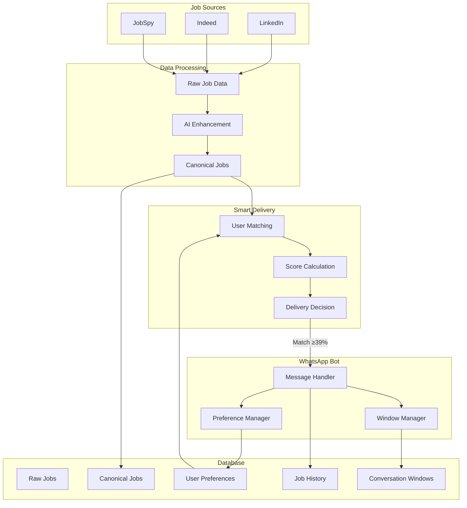
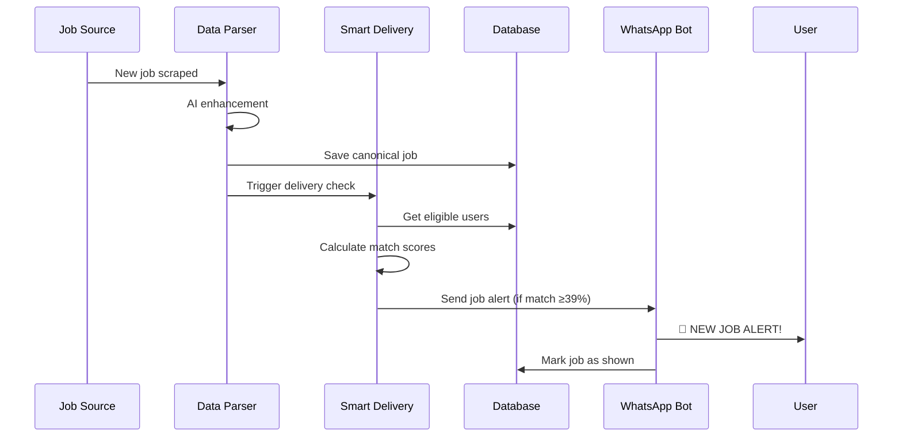
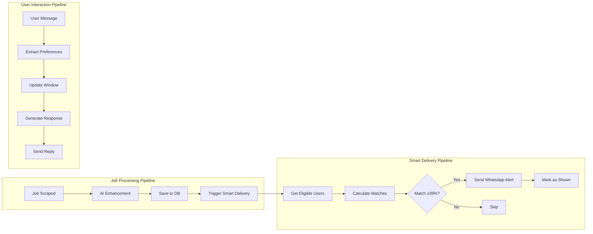
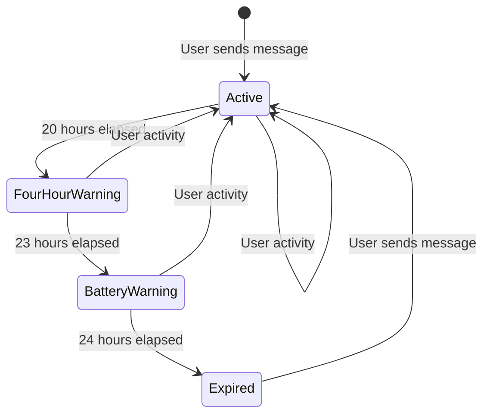
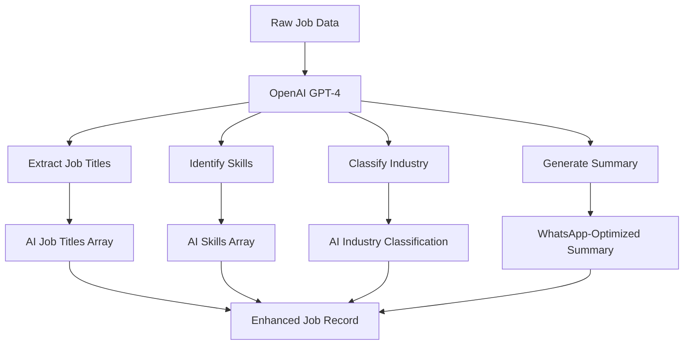

# 🏗️ Aremu System Architecture

## 📋 Table of Contents

- [🎯 System Overview](#-system-overview)
- [🔧 Core Components](#-core-components)
- [📊 Data Flow](#-data-flow)
- [🗄️ Database Schema](#️-database-schema)
- [⚡ Real-Time Pipeline](#-real-time-pipeline)
- [🔋 Window Management](#-window-management)
- [🧠 AI Components](#-ai-components)
- [📈 Performance & Scalability](#-performance--scalability)

## 🎯 System Overview

Aremu is built as a **real-time, event-driven job distribution system** with three main layers:

```
┌─────────────────────────────────────────────────────────────────┐
│                        PRESENTATION LAYER                       │
│                                                                 │
│  ┌─────────────────┐  ┌─────────────────┐  ┌─────────────────┐ │
│  │   WhatsApp UI   │  │   Admin Panel   │  │   Web Portal    │ │
│  └─────────────────┘  └─────────────────┘  └─────────────────┘ │
└─────────────────────────────────────────────────────────────────┘
                                │
┌─────────────────────────────────────────────────────────────────┐
│                        BUSINESS LOGIC LAYER                     │
│                                                                 │
│  ┌─────────────────┐  ┌─────────────────┐  ┌─────────────────┐ │
│  │  WhatsApp Bot   │  │  Smart Delivery │  │  Job Processor  │ │
│  │                 │  │     Engine      │  │                 │ │
│  │ • User Mgmt     │  │ • Real-time     │  │ • AI Enhancement│ │
│  │ • Preferences   │  │ • Matching      │  │ • Data Parsing  │ │
│  │ • Job Delivery  │  │ • Window Mgmt   │  │ • Source Mgmt   │ │
│  └─────────────────┘  └─────────────────┘  └─────────────────┘ │
└─────────────────────────────────────────────────────────────────┘
                                │
┌─────────────────────────────────────────────────────────────────┐
│                         DATA LAYER                              │
│                                                                 │
│  ┌─────────────────┐  ┌─────────────────┐  ┌─────────────────┐ │
│  │   PostgreSQL    │  │   Redis Cache   │  │  File Storage   │ │
│  │                 │  │                 │  │                 │ │
│  │ • User Data     │  │ • Session Data  │  │ • Logs          │ │
│  │ • Job Data      │  │ • Match Cache   │  │ • Backups       │ │
│  │ • Analytics     │  │ • Rate Limits   │  │ • Exports       │ │
│  └─────────────────┘  └─────────────────┘  └─────────────────┘ │
└─────────────────────────────────────────────────────────────────┘
```

## 🔧 Core Components

### 1. **WhatsApp Bot** (`/whatsapp_bot/`)

**Main Application** (`app.py`)
- Flask-based WhatsApp webhook handler
- Message routing and response generation
- User session management
- Error handling and logging

**Core Modules:**
- `database_manager.py` - Database connection and operations
- `flexible_preference_manager.py` - User preference handling
- `intelligent_job_matcher.py` - Advanced job matching algorithms
- `job_tracking_system.py` - Duplicate prevention and history
- `window_management_system.py` - 24-hour cost optimization
- `realtime_job_monitor.py` - Background job monitoring

### 2. **Data Parser** (`/data_parser/`)

**AI Enhanced Parser** (`parsers/ai_enhanced_parser.py`)
- OpenAI integration for job enhancement
- Multi-source job processing
- Real-time delivery integration
- Batch processing capabilities

**Smart Delivery Engine** (`smart_delivery_engine.py`)
- Event-driven job distribution
- User matching and scoring
- WhatsApp message delivery
- Performance monitoring

### 3. **Job Sources** (`/scraper/`)

**LinkedIn Scraper** (`linkedin/enhanced_linkedin_scraper.py`)
- Advanced LinkedIn job extraction
- Rate limiting and anti-detection
- Structured data output

**JobSpy Integration** (`jobspy/jobspy_scraper.py`)
- Multi-platform job aggregation
- Indeed, LinkedIn, and other sources
- Standardized job format

## 📊 Data Flow

### 🔄 **Complete System Flow**



### ⚡ **Real-Time Event Flow**



## 🗄️ Database Schema

### **Core Tables**

#### 1. **Users**
```sql
users (
    id SERIAL PRIMARY KEY,
    phone_number VARCHAR(20) UNIQUE,
    name VARCHAR(100),
    created_at TIMESTAMP DEFAULT NOW(),
    last_active TIMESTAMP DEFAULT NOW(),
    is_active BOOLEAN DEFAULT TRUE
)
```

#### 2. **User Preferences**
```sql
user_preferences (
    id SERIAL PRIMARY KEY,
    user_id INTEGER REFERENCES users(id),
    job_roles TEXT[],
    job_categories TEXT[],
    preferred_locations TEXT[],
    technical_skills TEXT[],
    years_of_experience INTEGER,
    salary_min INTEGER,
    salary_currency VARCHAR(10),
    work_arrangements TEXT[],
    preferences_confirmed BOOLEAN DEFAULT FALSE,
    created_at TIMESTAMP DEFAULT NOW(),
    updated_at TIMESTAMP DEFAULT NOW()
)
```

#### 3. **Canonical Jobs**
```sql
canonical_jobs (
    id SERIAL PRIMARY KEY,
    title VARCHAR(500),
    company VARCHAR(200),
    location VARCHAR(200),
    salary_min INTEGER,
    salary_max INTEGER,
    salary_currency VARCHAR(10),
    employment_type VARCHAR(50),
    work_arrangement VARCHAR(50),
    experience_level VARCHAR(50),
    posted_date DATE,
    job_url TEXT,
    description TEXT,
    
    -- AI Enhanced Fields
    ai_enhanced BOOLEAN DEFAULT FALSE,
    ai_job_titles TEXT[],
    ai_skills TEXT[],
    ai_industry TEXT[],
    ai_job_function VARCHAR(100),
    ai_summary TEXT,
    
    source VARCHAR(50),
    source_job_id VARCHAR(100),
    scraped_at TIMESTAMP DEFAULT NOW(),
    created_at TIMESTAMP DEFAULT NOW()
)
```

#### 4. **Job Tracking**
```sql
user_job_history (
    id SERIAL PRIMARY KEY,
    user_id INTEGER REFERENCES users(id),
    job_id INTEGER REFERENCES canonical_jobs(id),
    shown_at TIMESTAMP DEFAULT NOW(),
    match_score FLOAT,
    delivery_type VARCHAR(20),
    message_sent BOOLEAN DEFAULT TRUE,
    UNIQUE(user_id, job_id)
)
```

#### 5. **Window Management**
```sql
conversation_windows (
    id SERIAL PRIMARY KEY,
    user_id INTEGER REFERENCES users(id),
    window_start TIMESTAMP DEFAULT NOW(),
    last_activity TIMESTAMP DEFAULT NOW(),
    window_status VARCHAR(20) DEFAULT 'active',
    battery_warning_sent BOOLEAN DEFAULT FALSE,
    four_hour_reminder_sent BOOLEAN DEFAULT FALSE,
    messages_in_window INTEGER DEFAULT 0
)
```

## ⚡ Real-Time Pipeline

### **Event-Driven Architecture**



### **Performance Optimizations**

1. **Database Indexing**
   - B-tree indexes on frequently queried columns
   - GIN indexes for array fields (skills, locations)
   - Partial indexes for active records

2. **Caching Strategy**
   - Redis for user sessions
   - In-memory caching for match calculations
   - Query result caching for common searches

3. **Batch Processing**
   - Bulk job processing for efficiency
   - Batch WhatsApp message delivery
   - Scheduled cleanup operations

## 🔋 Window Management

### **24-Hour Lifecycle**

```mermaid
gantt
    title WhatsApp Window Management
    dateFormat X
    axisFormat %H:%M
    
    section Active Phase
    Job Delivery Active    :active, 0, 20h
    
    section Warning Phase
    4-Hour Reminder       :crit, 20h, 3h
    Battery Warning       :crit, 23h, 1h
    
    section Sleep Phase
    Window Expired        :done, 24h, 24h
```

### **State Transitions**



## 🧠 AI Components

### **1. Job Enhancement Pipeline**



### **2. Intelligent Matching Algorithm**

```python
def calculate_match_score(user_prefs, job):
    total_score = 0.0
    
    # AI Job Titles Matching (35 points)
    title_score = score_ai_job_titles_match(user_prefs, job)
    total_score += title_score * 0.35
    
    # Skills Matching (25 points)
    skills_score = score_skills_match(user_prefs, job)
    total_score += skills_score * 0.25
    
    # Location Matching (20 points)
    location_score = score_location_match(user_prefs, job)
    total_score += location_score * 0.20
    
    # Salary Matching (10 points)
    salary_score = score_salary_match(user_prefs, job)
    total_score += salary_score * 0.10
    
    # Experience Matching (10 points)
    experience_score = score_experience_match(user_prefs, job)
    total_score += experience_score * 0.10
    
    return min(total_score, 100.0)
```

## 📈 Performance & Scalability

### **Current Benchmarks**
- **Job Processing**: 50+ jobs/minute
- **User Matching**: <100ms per user
- **WhatsApp Delivery**: <2 seconds
- **Database Queries**: <50ms average
- **Match Accuracy**: 90%+ relevance

### **Scalability Targets**
- **Concurrent Users**: 10,000+
- **Daily Jobs**: 100,000+
- **Daily Messages**: 50,000+
- **Response Time**: <500ms
- **Uptime**: 99.9%

### **Monitoring & Alerting**
- Real-time performance metrics
- Error rate monitoring
- User engagement analytics
- System health dashboards
- Automated alerting for issues

---

**This architecture enables Aremu to deliver world-class job matching performance while maintaining cost efficiency and user satisfaction.**
