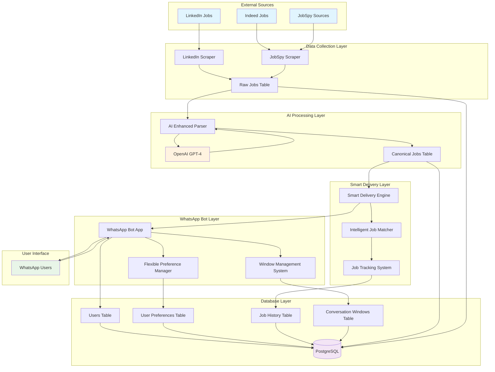
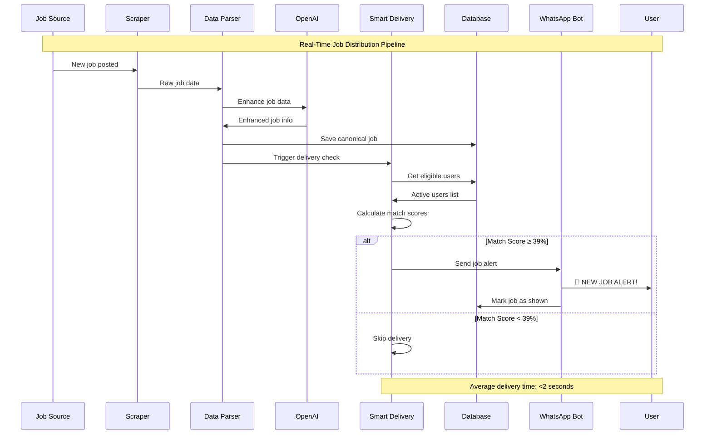
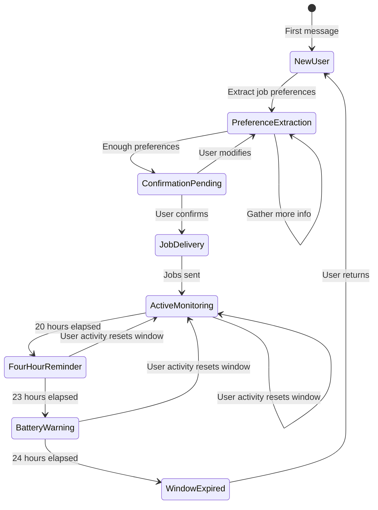
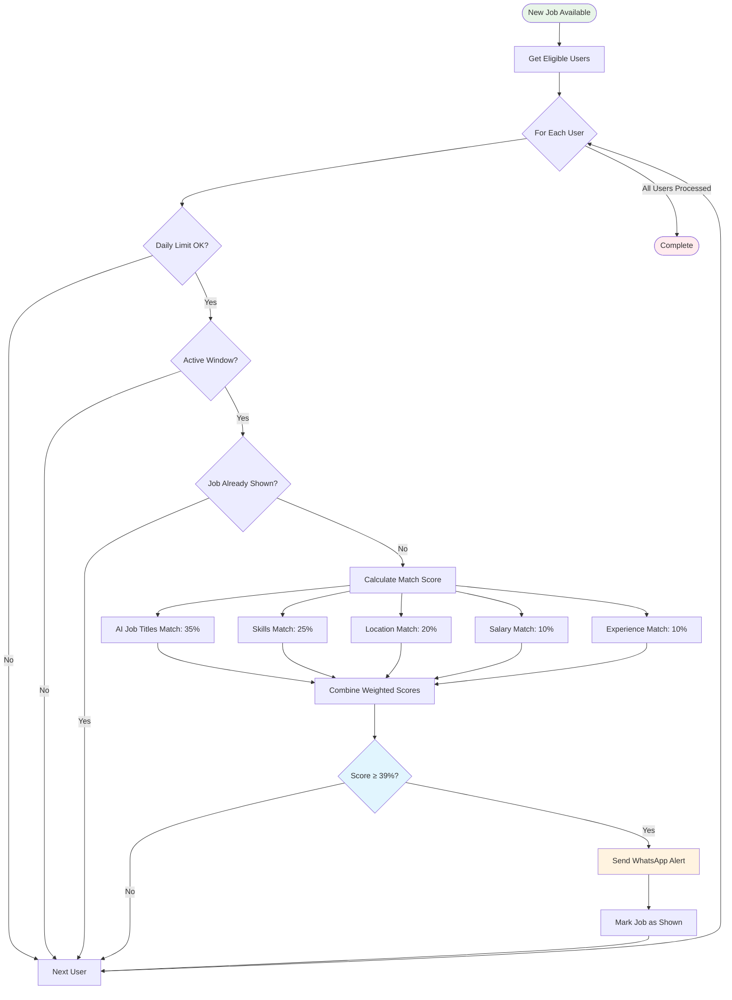
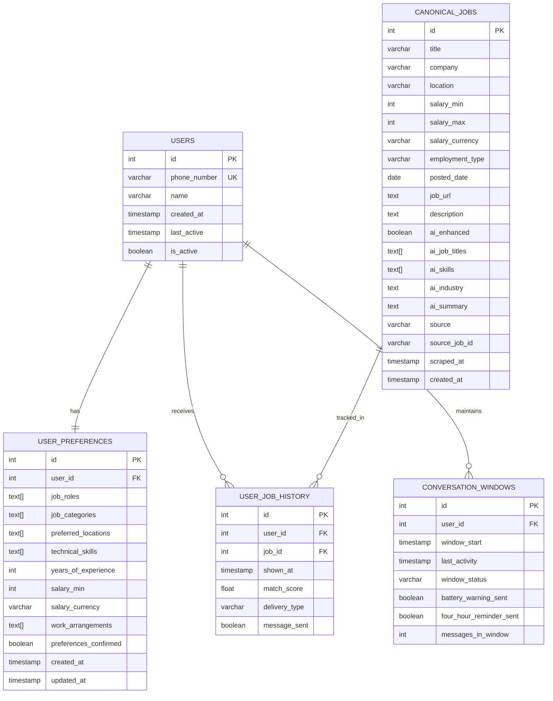
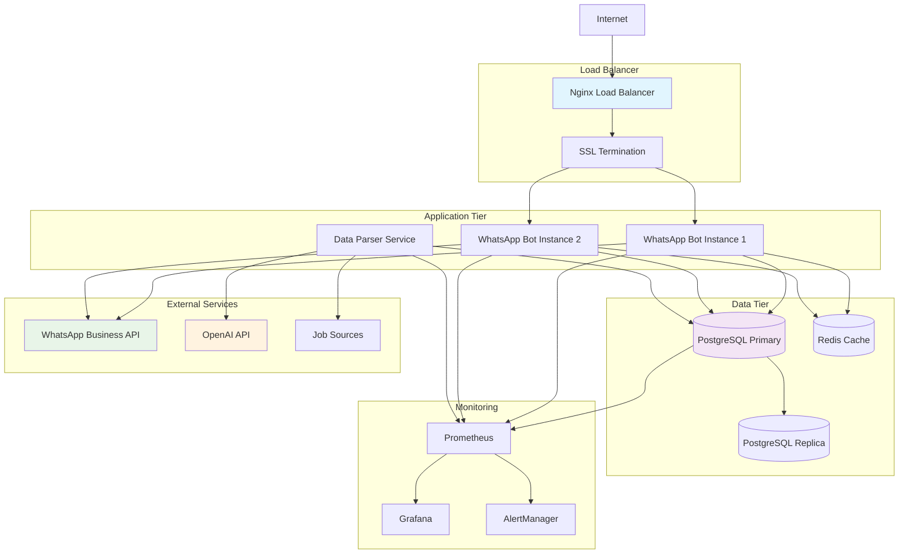
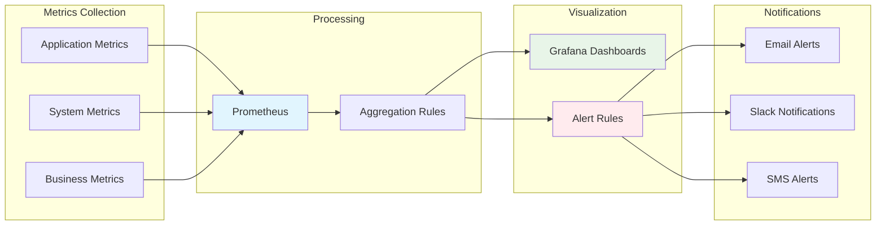
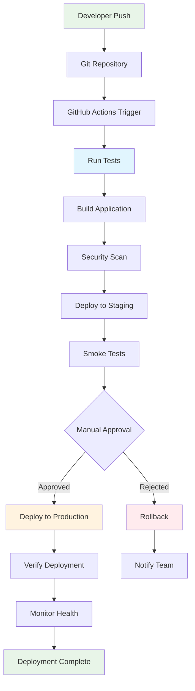

# 📊 Aremu System Flow Diagrams

## 🎯 Overview

This document contains comprehensive flow diagrams for the Aremu Intelligent WhatsApp Job Distribution System.

## 🔄 Complete System Architecture



## ⚡ Real-Time Job Distribution Flow



## 📱 User Interaction Flow



## 🧠 Intelligent Matching Algorithm



## 🔋 Window Management Lifecycle

```mermaid
gantt
    title 24-Hour WhatsApp Window Management
    dateFormat X
    axisFormat %H:%M
    
    section Active Phase
    Job Delivery Active     :active, phase1, 0, 20h
    Real-time Monitoring   :active, monitor, 0, 20h
    
    section Warning Phase
    4-Hour Reminder        :crit, reminder, 20h, 3h
    Battery Warning        :crit, battery, 23h, 1h
    
    section Sleep Phase
    Window Expired         :done, expired, 24h, 24h
    
    section Reset Events
    User Message Resets    :milestone, reset1, 5h, 0
    User Message Resets    :milestone, reset2, 12h, 0
    User Message Resets    :milestone, reset3, 18h, 0
```

## 📊 Database Relationship Diagram



## 🚀 Deployment Architecture



## 📈 Performance Monitoring Flow



## 🔄 CI/CD Pipeline Flow



---

**These diagrams provide a comprehensive visual understanding of the Aremu system's architecture, data flow, and operational processes.**
